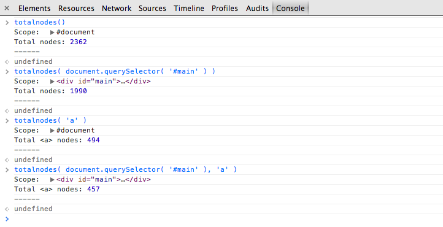
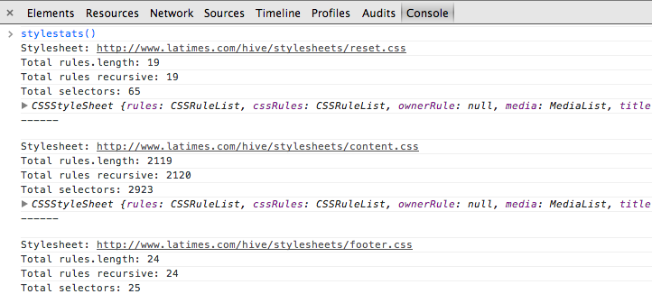
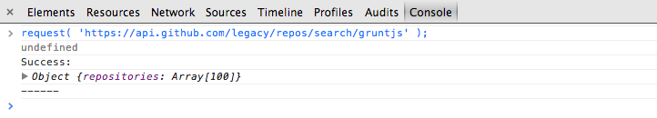

# About #

Helpful snippets for working in your browser's console.

You can read more about snippets at the Chrome developer tools documentation. More on using snippets in:

- [Chrome developer tools](https://developers.google.com/chrome-developer-tools/docs/authoring-development-workflow#snippets)
- [Firefox developers tools documentation](https://developer.mozilla.org/en-US/docs/Tools/Scratchpad)


## totalnodes.js ##

Count the total number of nodes inside a specified element.

### Options ###

- `wrapper` {HTMLElement} - The element to search within. Defaults to `document`.
- `tag` {String} - The element tag to count. Defaults to `*`.


### Usage ###

```js
totalnodes();
totalnodes( wrapper );
totalnodes( 'tag' );
totalnodes( wrapper, 'tag' );
```

### Results ###




## stylestats.js ##

Originally from [this Stack Overflow thread](http://stackoverflow.com/questions/5228459/selector-count-in-css/12313690#12313690) and adapted to support the differences between IE and other browsers.

### Usage ###

```js
stylestats();
```

### Results ###




## request.js ##

A simple function to make async requests. Great for testing your API responses.


### Usage ###

```js
request( 'http://example.com' );
```


### Results ###




## hashlink.js ##

From [bgrins/devtools-snippets](https://github.com/bgrins/devtools-snippets). View the [documentation](http://bgrins.github.io/devtools-snippets/#hashlink).


## jquerify.js ##

From [bgrins/devtools-snippets](https://github.com/bgrins/devtools-snippets). View the [documentation](http://bgrins.github.io/devtools-snippets/#jquerify).


## performance.js ##

From [bgrins/devtools-snippets](https://github.com/bgrins/devtools-snippets). View the [documentation](http://bgrins.github.io/devtools-snippets/#performance).

